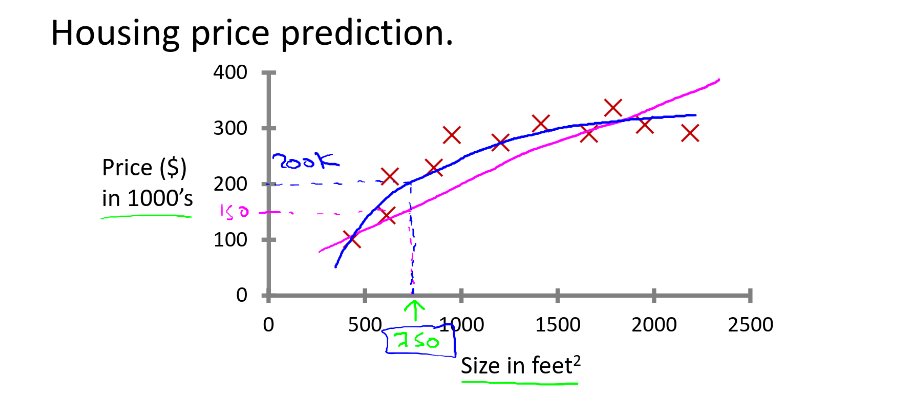
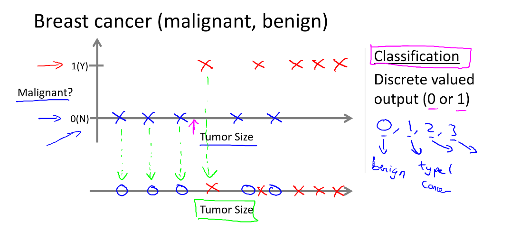

# Machine learning by Andrew Ng 

# Introduction
A computer program is said to learn from experience E with respect to some task T and some performance measure P , if its performance on T, 
as measured by P, improves with experience E." 

## Supervised learning 
We provide a dataset with the "right answer".

Algorithms
- Regression predict real-valued (continious) as the value of a house
- Classification as the kind of fruit in a picture
- Others
  - Reinforcement learning
  - Recommender systems

Example of a regression algorithm 
<pre>

</pre>

Example of a classification algorith
<pre>

</pre>

## Unsupervised learning
We do not provide a dataset with the "right data"

It is meant to find structure in the data as market segmentation.

# Model representation

## Linear regression with one variable

