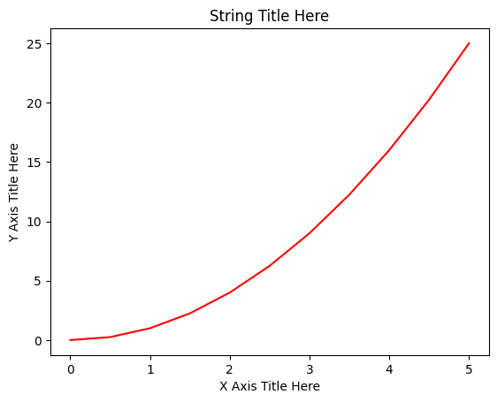
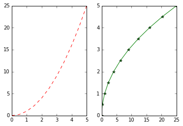
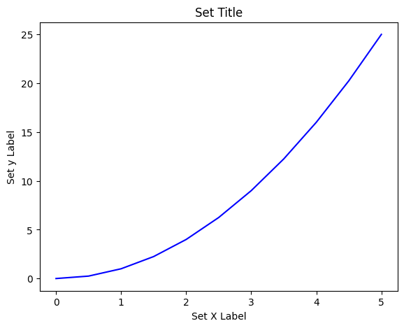
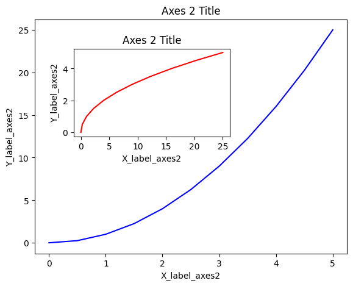
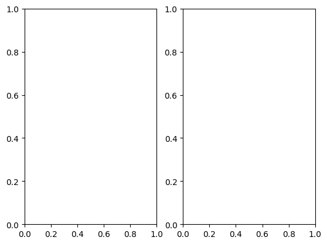
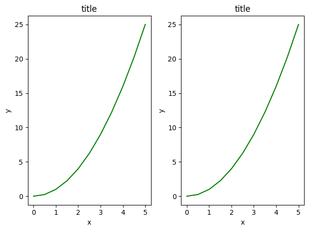
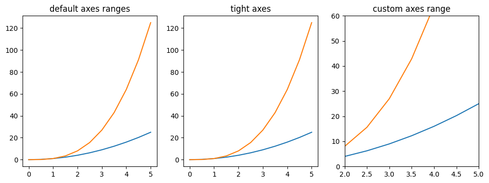
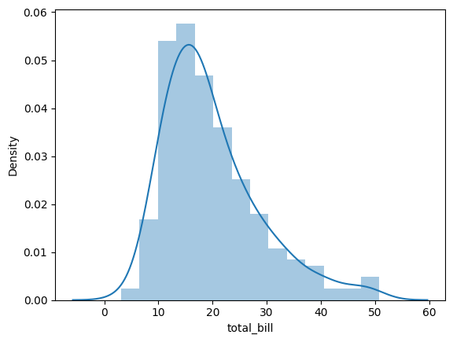
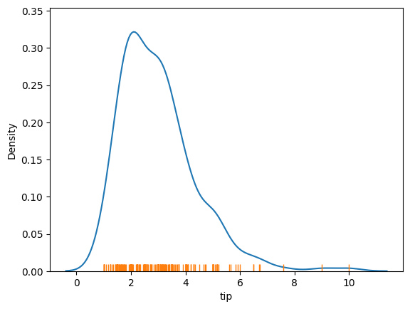
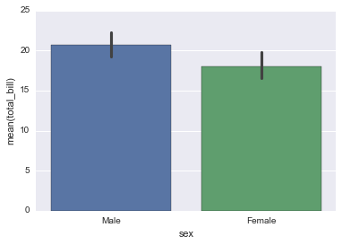

# Python for Data Science and Machine Learning Bootcamp – Jose Portilla (Udemy)
##  Introduction to python crash couse

### printing
```
num = 12
name = 'Sam'

print('My number is: {one}, and my name is: {two}'.format(one=num,two=name))
My number is: 12, and my name is: Sam

print('My number is: {}, and my name is: {}'.format(num,name))
My number is: 12, and my name is: Sam
```


### List: Ordered, Mutable Collection
- **Ordered:** Elements maintain their insertion order.  
- **Mutable:** You can modify, add, or remove elements.  
- **Allows duplicates.**


```python
my_list = [1, 2, 3, 3, "hello"]
print(my_list[0])  # 1

my_list.append(4)
print(my_list)     # [1, 2, 3, 3, 'hello', 4]
```

### Tuple: Ordered, Immutable Collection
- **Ordered:** Like lists, order is preserved
- ** Immutable:** Once created, it cannot be changed
- ** Allows duplicates**
```
my_tuple = (1, 2, 3)
print(my_tuple[1])  # 2

# my_tuple[1] = 5  # ❌ Error – tuples can’t be modified
```

### Dictionary (dict): Key–Value Pairs
- **Unordered** (since Python 3.7 → insertion-ordered)
- **Mutable**: You can add, remove, or change key-value pairs
- **Keys must be unique and immutable**

```
my_dict = {"name": "Alice", "age": 30, "city": "Paris"}
print(my_dict["name"])  # Alice

my_dict["age"] = 31     # Update
my_dict["country"] = "France"  # Add new key
print(my_dict)
# {'name': 'Alice', 'age': 31, 'city': 'Paris', 'country': 'France'}
```

### Set: Unordered Collection of Unique Items
- **Unordered:** No index or defined order
- **Mutable:** You can add/remove items
- **No duplicates allowed**
```
my_set = {1, 2, 2, 3, 4}
print(my_set)  # {1, 2, 3, 4}

my_set.add(5)
my_set.remove(3)
print(my_set)  # {1, 2, 4, 5}
```

### Functions
Code used more than once o for clarity
```
def my_func(var)
  """
  THIS IS A DOC STRING
  Info providede when Shift + Tab
  """
  print('Hello ' +name)

my_func(José)
Hello José


```

## Python for Data Analysis  - Numpy
### Introducción
Numpy trabaja con Numpy Arrais
- Vectors (1 d array)
- Array (matriz)

### Numpy Array
Creo un numpy array
```
my_list = [1,2,3]
np.array(my_list)

my_matrix = [[1,2,3],[4,5,6],[7,8,9]]
np.array(my_matrix)

np.arange(0,10)
array([0, 1, 2, 3, 4, 5, 6, 7, 8, 9])

np.arange(0,11,2)
array([ 0,  2,  4,  6,  8, 10])

np.zeros(3)
array([ 0.,  0.,  0.])

np.zeros((5,5))
array([[ 0.,  0.,  0.,  0.,  0.],
       [ 0.,  0.,  0.,  0.,  0.],
       [ 0.,  0.,  0.,  0.,  0.],
       [ 0.,  0.,  0.,  0.,  0.],
       [ 0.,  0.,  0.,  0.,  0.]])

np.ones((3,4))
array([[1., 1., 1., 1.],
       [1., 1., 1., 1.],
       [1., 1., 1., 1.]])
```

### linspace Creo un array con numberos separados de forma equidistante
```
np.linspace(0,10,3)
array([ 0.,  5., 10.])
```

### Matriz identidad
```
np.eye(4)
array([[ 1.,  0.,  0.,  0.],
       [ 0.,  1.,  0.,  0.],
       [ 0.,  0.,  1.,  0.],
       [ 0.,  0.,  0.,  1.]])
```

### Random
rand crea números entre 0 y 1
```
np.random.rand(5,5)
array([[0.44929898, 0.89160936, 0.40444023, 0.02757594, 0.08884555],
       [0.47367313, 0.11225391, 0.4955617 , 0.28784571, 0.66607695],
       [0.47367866, 0.5194453 , 0.35563614, 0.64282024, 0.04975028],
       [0.06815864, 0.23308848, 0.18330004, 0.65306233, 0.76903471],
       [0.99048808, 0.69580378, 0.89698572, 0.12230147, 0.9922881 ]])
```

randn crea números según una distribución normal centrada en 0
```
np.random.randn(5,5)
array([[ 0.13472148, -0.75450279, -0.97847649,  0.66480845, -1.05863038],
       [ 1.48196232,  0.99722198, -0.62302153, -0.51158007,  0.29080428],
       [ 1.23855807,  0.60210283,  0.94860448,  0.82414583, -0.61187368],
       [-0.79993548,  1.19655447, -0.55748516, -1.39554422, -0.58397525],
       [-0.20119201, -0.2844824 ,  0.06018214, -1.33721035, -1.75851488]])
```

randint crea números enteros desde low hasta pero sin incluir high
```
np.random.randint(1,100,10)
array([94, 79, 82, 41, 99, 35, 46, 68, 74, 15])
```

### Atributos y métodos
Reshape convierte un vector 1,m en una matriz cuadrada siempre que nxn=m
```
arr = np.arange(25)
array([ 0,  1,  2,  3,  4,  5,  6,  7,  8,  9, 10, 11, 12, 13, 14, 15, 16,
       17, 18, 19, 20, 21, 22, 23, 24])
arr.reshape(5,5)


array([[ 0,  1,  2,  3,  4],
       [ 5,  6,  7,  8,  9],
       [10, 11, 12, 13, 14],
       [15, 16, 17, 18, 19],
       [20, 21, 22, 23, 24]])
```

Obtener el min, max y sus indices
```
ranarr = np.random.randint(0,50,10)
array([10, 12, 41, 17, 49,  2, 46,  3, 19, 39])

ranarr.max()
49
ranarr.argmax()
4
ranarr.min()
2
ranarr.argmin()
5
```

Shape dice el tamaño de la matriz y reshape cambia el tamaño
```
arr.shape
(25,)

arr.reshape(25,1)


array([[ 0],
       [ 1],
       [ 2],
       [ 3],
       [ 4],
       [ 5],
       [ 6],
       [ 7],
       [ 8],
       [ 9],
       [10],
       [11],
       [12],
       [13],
       [14],
       [15],
       [16],
       [17],
       [18],
       [19],
       [20],
       [21],
       [22],
       [23],
       [24]])
```

### Tipo de array
```
arr.dtype
dtype('int64')
```

## Numpy array index
creo un arrai
```
arr = np.arange(0,11)
array([ 0,  1,  2,  3,  4,  5,  6,  7,  8,  9, 10])
```

### Indexing
Obtengo un rango de valores
```
arr[1:5]

array([0, 1, 2, 3, 4])
```

### Broadcasting
Asigno un valor a un rango de un array
```
arr[0:5]=100
array([100, 100, 100, 100, 100,   5,   6,   7,   8,   9,  10])
```

**Slice** de un array no es una copia es una imagen del array original
```
arr = np.arange(0,11)
array([ 0,  1,  2,  3,  4,  5,  6,  7,  8,  9, 10])

slice_of_arr = arr[0:6]
array([0, 1, 2, 3, 4, 5])

slice_of_arr[:]=99
array([99, 99, 99, 99, 99, 99])

arr
array([99, 99, 99, 99, 99, 99,  6,  7,  8,  9, 10])
```

Si quiero copiar un array lo tengo que decir explicitamente
```
arr_copy = arr.copy()
```

### indexing a 2D array (matriz)
```
arr_2d = np.array(([5,10,15],[20,25,30],[35,40,45]))
array([[ 5, 10, 15],
       [20, 25, 30],
       [35, 40, 45]])

arr_2d[1]
array([20, 25, 30])
```

Hay 2 formatos
- arr_2d[row][col]
- arr_2d[row,col]

```
arr_2d[1][0]
20

arr_2d[1,0]
20

arr_2d[:2,1:]
array([[10, 15],
       [25, 30]])
```

### Seleccionar una matriz
```
arr2d
array([[0., 0., 0., 0., 0., 0., 0., 0., 0., 0.],
       [1., 1., 1., 1., 1., 1., 1., 1., 1., 1.],
       [2., 2., 2., 2., 2., 2., 2., 2., 2., 2.],
       [3., 3., 3., 3., 3., 3., 3., 3., 3., 3.],
       [4., 4., 4., 4., 4., 4., 4., 4., 4., 4.],
       [5., 5., 5., 5., 5., 5., 5., 5., 5., 5.],
       [6., 6., 6., 6., 6., 6., 6., 6., 6., 6.],
       [7., 7., 7., 7., 7., 7., 7., 7., 7., 7.],
       [8., 8., 8., 8., 8., 8., 8., 8., 8., 8.],
       [9., 9., 9., 9., 9., 9., 9., 9., 9., 9.]])

arr2d[[6,4,2,7]]
rray([[ 6.,  6.,  6.,  6.,  6.,  6.,  6.,  6.,  6.,  6.],
       [ 4.,  4.,  4.,  4.,  4.,  4.,  4.,  4.,  4.,  4.],
       [ 2.,  2.,  2.,  2.,  2.,  2.,  2.,  2.,  2.,  2.],
       [ 7.,  7.,  7.,  7.,  7.,  7.,  7.,  7.,  7.,  7.]])
```

### Selección por comparación
```
arr = np.arange(1,11)
array([ 1,  2,  3,  4,  5,  6,  7,  8,  9, 10])

arr > 4
array([False, False, False, False,  True,  True,  True,  True,  True,  True], dtype=bool)

bool_arr = arr>4
array([False, False, False, False,  True,  True,  True,  True,  True,  True], dtype=bool)

arr[bool_arr]
array([ 5,  6,  7,  8,  9, 10])
```

o en un paso
```
arr[arr>2]
array([ 3,  4,  5,  6,  7,  8,  9, 10])
```

### Operaciones en numpy
```
arr = np.arange(0,10)

arr + arr
array([ 0,  2,  4,  6,  8, 10, 12, 14, 16, 18])
```

** numpy da un warning no un error al dividir por cero o da infinito si 1/0
```
arr/arr
/tmp/ipython-input-2878212635.py:3: RuntimeWarning: invalid value encountered in divide
  arr/arr

array([nan,  1.,  1.,  1.,  1.,  1.,  1.,  1.,  1.,  1.])
```

[Funciones universales](https://www.google.com/url?q=http%3A%2F%2Fdocs.scipy.org%2Fdoc%2Fnumpy%2Freference%2Fufuncs.html
)

```
np.sqrt(arr)
np.exp(arr)
np.max(arr) #same as arr.max()
np.sin(arr)
np.sin(arr)
```

## Python for data analysis: Panda

### Introducción
Análisis  y preparación de datos

### Series
Es un tipo de datos de Panda
es como un array de numpy pero con labels/index

El índice funciona como un hash

Una serie necesita
- datos
- indice

Creo los datos y los indices
```
labels = ['a','b','c']             # python list
my_list = [10,20,30]               
arr = np.array([10,20,30])         # numpy array
d = {'a':10,'b':20,'c':30}         # python dic
```

Creo una serie a partir de una lista, con el indice por defecto
```
pd.Series(data=my_list)
0 	10
1 	20
2 	30

dtype: int64
```


Creo una serie a partir de una lista
```
Creo una serie a partir de una lista, con el indice por defecto
```
pd.Series(data=my_list,index=labels)

dtype: int64
```
a 	10
b 	20
c 	30

dtype: int64
```

Creo una serie a partir de un np array
```
pd.Series(arr,labels)


a    10
b    20
c    30
dtype: int64
```

Creo una serie a partir de un dic. Pone el indice del valor del key
```
pd.Series(d)
a 	10
b 	20
c 	30

dtype: int64
```

Accedo a una serie por indice
```
ser1 = pd.Series([1,2,3,4],index = ['USA', 'Germany','USSR', 'Japan'])  
ser2 = pd.Series([1,2,5,4],index = ['USA', 'Germany','Italy', 'Japan'])   

ser1['USA']
1
```

Se pueden sumar, restar series. Se hace la operaciń si la key está en las 2 series, sino Nan
```
ser1 + ser2
Germany    4.0
Italy      NaN
Japan      8.0
USA        2.0
USSR       NaN
dtype: float64
```

### Dataframes
Se puede poner indices en filas o columnas

Creo un dataframe y hago varias selecciones
```
df = pd.DataFrame(randn(5,4),index='A B C D E'.split(),columns='W X Y Z'.split()) con indices
 	W 	       X 	       Y 	       Z
A 	2.706850 	0.628133 	0.907969 	0.503826
B 	0.651118 	-0.319318 	-0.848077 	0.605965
C 	-2.018168 	0.740122 	0.528813 	-0.589001
D 	0.188695 	-0.758872 	-0.933237 	0.955057
E 	0.190794 	1.978757 	2.605967 	0.683509

df['W']
A    2.706850
B    0.651118
C   -2.018168
D    0.188695
E    0.190794
Name: W, dtype: float64

df[['W','Z']]
       W       	Z
A 	2.706850 	0.503826
B 	0.651118 	0.605965
C 	-2.018168 	-0.589001
D 	0.188695 	0.955057
E 	0.190794 	0.683509

df.W   # es posible este método pero no es recomendble ya que se puede sobrecargar un método
A    2.706850
B    0.651118
C   -2.018168
D    0.188695
E    0.190794
Name: W, dtype: float64
```

Lo que seleccionamos son series
```
type(df['W'])
pandas.core.series.Series
```

Creo una columna, elimino
```
df['new'] = df['W'] + df['Y']
 	W 	       X 	       Y 	       Z 	       new
A 	2.706850 	0.628133 	0.907969 	0.503826 	3.614819
B 	0.651118 	-0.319318 	-0.848077 	0.605965 	-0.196959
C 	-2.018168 	0.740122 	0.528813 	-0.589001 	-1.489355
D 	0.188695 	-0.758872 	-0.933237 	0.955057 	-0.744542
E 	0.190794 	1.978757 	2.605967 	0.683509 	2.796762

df.drop('new',axis=1) # axis 0 es una fila y 1 columna
# para borrar una columna definitivamente hay que añadir inplace=True
 	W 	       X 	       Y 	       Z
A 	2.706850 	0.628133 	0.907969 	0.503826
B 	0.651118 	-0.319318 	-0.848077 	0.605965
C 	-2.018168 	0.740122 	0.528813 	-0.589001
D 	0.188695 	-0.758872 	-0.933237 	0.955057
E 	0.190794 	1.978757 	2.605967 	0.683509

df
 	W 	       X 	       Y 	       Z 	       new
A 	2.706850 	0.628133 	0.907969 	0.503826 	3.614819
B 	0.651118 	-0.319318 	-0.848077 	0.605965 	-0.196959
C 	-2.018168 	0.740122 	0.528813 	-0.589001 	-1.489355
D 	0.188695 	-0.758872 	-0.933237 	0.955057 	-0.744542
E 	0.190794 	1.978757 	2.605967 	0.683509 	2.796762


df.drop('new',axis=1,inplace=True)
 	W 	       X 	       Y 	       Z
A 	2.706850 	0.628133 	0.907969 	0.503826
B 	0.651118 	-0.319318 	-0.848077 	0.605965
C 	-2.018168 	0.740122 	0.528813 	-0.589001
D 	0.188695 	-0.758872 	-0.933237 	0.955057
E 	0.190794 	1.978757 	2.605967 	0.683509
```

Selecciono por index o número
```
df.loc['A']
       A
W 	2.706850
X 	0.628133
Y 	0.907969
Z 	0.503826

df.iloc[2]
W   -2.018168
X    0.740122
Y    0.528813
Z   -0.589001
Name: C, dtype: float64

df.loc['B','Y']
np.float64(-0.8480769834036315)

df.loc[['A','B'],['W','Y']]
       W       	Y
A 	2.706850 	0.907969
B 	0.651118 	-0.848077
```

Selección condicional
```
df>0
       W 	X 	Y 	Z
A 	True 	True 	True 	True
B 	True 	False 	False 	True
C 	False 	True 	True 	False
D 	True 	False 	False 	True
E 	True 	True 	True 	True

df[df>0]
       W 	       X 	Y       	       Z
A 	2.706850 	0.628133 	0.907969 	0.503826
B 	0.651118 	NaN 	       NaN 	       0.605965
C 	NaN 	       0.740122 	0.528813 	NaN
D 	0.188695 	NaN 	       NaN 	       0.955057
E 	0.190794 	1.978757 	2.605967 	0.683509

df[df['W']>0] # valores de w > 0
 	W 	X 	Y 	Z
A 	2.706850 	0.628133 	0.907969 	0.503826
B 	0.651118 	-0.319318 	-0.848077 	0.605965
D 	0.188695 	-0.758872 	-0.933237 	0.955057
E 	0.190794 	1.978757 	2.605967 	0.683509

df[df['W']>0]['Y']
       Y
A 	0.907969
B 	-0.848077
D 	-0.933237
E 	2.605967

df[(df['W']>0) & (df['Y'] > 1)]
       W 	       X 	       Y 	       Z
E 	0.190794 	1.978757 	2.605967 	0.683509
```

Se puede resetear los indices y cambiarlos a numeros de 0 ...
```
df.reset_index()
index 	       W 	       X             Y 	       Z
0 	A 	2.706850 	0.628133 	0.907969 	0.503826
1 	B 	0.651118 	-0.319318 	-0.848077 	0.605965
2 	C 	-2.018168 	0.740122 	0.528813 	-0.589001
3 	D 	0.188695 	-0.758872 	-0.933237 	0.955057
4 	E 	0.190794 	1.978757 	2.605967 	0.683509
```

Se puede cambiar un indice
```
newind = 'CA NY WY OR CO'.split()
df['States'] = newind
       W 	       X 	       Y 	       Z 	S      tates
A 	2.706850 	0.628133 	0.907969 	0.503826 	CA
B 	0.651118 	-0.319318 	-0.848077 	0.605965 	NY
C 	-2.018168 	0.740122 	0.528813 	-0.589001 	WY
D 	0.188695 	-0.758872 	-0.933237 	0.955057 	OR
E 	0.190794 	1.978757 	2.605967 	0.683509 	CO     

df.set_index('States')
       W           	X      	Y 	       Z
States 				
CA 	2.706850 	0.628133 	0.907969 	0.503826
NY 	0.651118 	-0.319318 	-0.848077 	0.605965
WY 	-2.018168 	0.740122 	0.528813 	-0.589001
OR 	0.188695 	-0.758872 	-0.933237 	0.955057
CO 	0.190794 	1.978757 	2.605967 	0.683509
```

multiindices
```
# Index Levels
outside = ['G1','G1','G1','G2','G2','G2']
inside = [1,2,3,1,2,3]
hier_index = list(zip(outside,inside))  # crea una lista de tuples en este caso [('G1', 1), ('G1', 2), ('G1', 3), ('G2', 1), ('G2', 2), ('G2', 3)]
hier_index = pd.MultiIndex.from_tuples(hier_index) # crea el multi indice

hier_index
MultiIndex([('G1', 1),
            ('G1', 2),
            ('G1', 3),
            ('G2', 1),
            ('G2', 2),
            ('G2', 3)],
           )

df = pd.DataFrame(np.random.randn(6,2),index=hier_index,columns=['A','B'])
              A             B
G1 	1 	0.302665 	1.693723
       2 	-1.706086 	-1.159119
       3 	-0.134841 	0.390528
G2 	1 	0.166905 	0.184502
       2 	0.807706 	0.072960
       3 	0.638787 	0.329646

df.loc['G1']
       A 	       B
1 	0.302665 	1.693723
2 	-1.706086 	-1.159119
3 	-0.134841 	0.390528

df.loc['G1'].loc[1]
A 	0.302665
B 	1.693723
Name: 1, dtype: float64

```

Doy nombre a los indices
```
df.index.names = ['Group','Num']
              A       	B
Group 	Num 		
G1 	1 	0.302665 	1.693723
       2      -1.706086 	-1.159119
       3 	-0.134841 	0.390528
G2 	1 	0.166905 	0.184502
       2 	0.807706 	0.072960
       3 	0.638787 	0.329646
```

Esto es la funcion cross-section
```
df.xs('G1')
       A       	B
Num 		
1 	0.302665 	1.693723
2 	-1.706086 	-1.159119
3 	-0.134841 	0.390528


df.xs(1,level='Num')
       A       	B
Group 		
G1 	0.153661 	0.167638
G2 	-1.549671 	0.435253
```

### Missing data
Preparativos, creo un data frame a partir de un diccionario de listas
```
df = pd.DataFrame({'A':[1,2,np.nan],
                  'B':[5,np.nan,np.nan],
                  'C':[1,2,3]})
 	A 	B 	C
0 	1.0 	5.0 	1
1 	2.0 	NaN 	2
2 	NaN 	NaN 	3
```

Pruebo formas de eliminar las celdas sin datos o rellenarlas
```
# borro las filas con nana
df.dropna()
       A 	B 	C
0 	1.0 	5.0 	1

# borro las columnas con nan
df.dropna(axis=1)
 	C
0 	1
1 	2
2 	3

# si solo quiero borrar aquelas que tengan 2 Nan o mas
df.dropna(thresh=2)
 	A 	B 	C
0 	1.0 	5.0 	1
1 	2.0 	NaN 	2

# relleno las celdas con un valor
df.fillna(value='FILL VALUE')
       A    	       B 	       C
0 	1.0 	       5.0 	       1
1 	2.0 	       FILL VALUE 	2
2 	FILL VALUE 	FILL VALUE 	3

# rellena la columna a con el mean
df['A'].fillna(value=df['A'].mean())
       A      
0 	1.0
1 	2.0
2 	1.5
```

### groupby
Permite agrupar datos
```
data = {'Company':['GOOG','GOOG','MSFT','MSFT','FB','FB'],
       'Person':['Sam','Charlie','Amy','Vanessa','Carl','Sarah'],
       'Sales':[200,120,340,124,243,350]}

df = pd.DataFrame(data)

 	Company 	Person 	Sales
0 	GOOG 	       Sam 	       200
1 	GOOG 	       Charlie 	120
2 	MSFT 	       Amy 	       340
3 	MSFT 	       Vanessa 	124
4 	FB 	       Carl 	       243
5 	FB 	       Sarah  	350
```

Agrupo
```
df = pd.DataFrame(data) # crea un objeto que guardo como variable
df = pd.DataFrame(data)
```

```
# He tenido que borrar la columan de persona para la media
df.drop('Person',axis=1,inplace=True)
 	Company 	Sales
0 	GOOG 	       200
1 	GOOG 	       120
2 	MSFT 	       340
3 	MSFT 	       124
4 	FB 	       243
5 	FB 	       350

# agrupo por compañia
by_comp = df.groupby("Company")
 	Sales
Company 	
FB 	296.5
GOOG 	160.0
MSFT 	232.0

# saco la media
df.groupby('Company').mean()
 	Sales
Company 	
FB 	296.5
GOOG 	160.0
MSFT 	232.0

# puedo sacar informacion
by_comp.describe()
              Sales
Company 		
FB 	count 	2.000000
       mean 	296.500000
       std 	75.660426
       min 	243.000000
       25% 	269.750000
       50% 	296.500000
       75% 	323.250000
       max 	350.000000
GOOG 	count 	2.000000
       mean 	160.000000
       std 	56.568542
       min 	120.000000
       25% 	140.000000
       50% 	160.000000
       75% 	180.000000
       max 	200.000000
MSFT 	count 	2.000000
       mean 	232.000000
       std 	152.735065
       min 	124.000000
       25% 	178.000000
       50% 	232.000000
       75% 	286.000000
       max 	340.000000


by_comp.describe().transpose()
       Company 	FB 	GOOG 	MSFT
Sales 	count 	2.000000 	2.000000 	2.000000
       mean 	296.500000 	160.000000 	232.000000
       std 	75.660426 	56.568542 	152.735065
       min 	243.000000 	120.000000 	124.000000
       25% 	269.750000 	140.000000 	178.000000
       50% 	296.500000 	160.000000 	232.000000
       75% 	323.250000 	180.000000 	286.000000
       max 	350.000000 	200.000000 	340.000000


by_comp.describe().transpose()['GOOG']
GOOG
Sales 	count 	2.000000
       mean 	160.000000
       std 	56.568542
       min 	120.000000
       25% 	140.000000
       50% 	160.000000
       75% 	180.000000
       max 	200.000000
```

### Merging, Joining, and Concatenating
Preparativos
```
df1 = pd.DataFrame({'A': ['A0', 'A1', 'A2', 'A3'],
                        'B': ['B0', 'B1', 'B2', 'B3'],
                        'C': ['C0', 'C1', 'C2', 'C3'],
                        'D': ['D0', 'D1', 'D2', 'D3']},
                        index=[0, 1, 2, 3])

df2 = pd.DataFrame({'A': ['A4', 'A5', 'A6', 'A7'],
                        'B': ['B4', 'B5', 'B6', 'B7'],
                        'C': ['C4', 'C5', 'C6', 'C7'],
                        'D': ['D4', 'D5', 'D6', 'D7']},
                         index=[4, 5, 6, 7]) 

df3 = pd.DataFrame({'A': ['A8', 'A9', 'A10', 'A11'],
                        'B': ['B8', 'B9', 'B10', 'B11'],
                        'C': ['C8', 'C9', 'C10', 'C11'],
                        'D': ['D8', 'D9', 'D10', 'D11']},
                        index=[8, 9, 10, 11])

df1
 	A 	B 	C 	D
0 	A0 	B0 	C0 	D0
1 	A1 	B1 	C1 	D1
2 	A2 	B2 	C2 	D2
3 	A3 	B3 	C3 	D3

df2
 	A 	B 	C 	D
4 	A4 	B4 	C4 	D4
5 	A5 	B5 	C5 	D5
6 	A6 	B6 	C6 	D6
7 	A7 	B7 	C7 	D7

df3
 	A 	B 	C 	D
4 	A4 	B4 	C4 	D4
5 	A5 	B5 	C5 	D5
6 	A6 	B6 	C6 	D6
7 	A7 	B7 	C7 	D7
```

Concatenación
```
pd.concat([df1,df2,df3])
A 	B 	C 	D
0 	A0 	B0 	C0 	D0
1 	A1 	B1 	C1 	D1
2 	A2 	B2 	C2 	D2
3 	A3 	B3 	C3 	D3
4 	A4 	B4 	C4 	D4
5 	A5 	B5 	C5 	D5
6 	A6 	B6 	C6 	D6
7 	A7 	B7 	C7 	D7
8 	A8 	B8 	C8 	D8
9 	A9 	B9 	C9 	D9
10 	A10 	B10 	C10 	D10
11 	A11 	B11 	C11 	D11

pd.concat([df1,df2,df3],axis=1)
 	A 	B 	C 	D 	A 	B 	C 	D 	A 	B 	C 	D
0 	A0 	B0 	C0 	D0 	NaN 	NaN 	NaN 	NaN 	NaN 	NaN 	NaN 	NaN
1 	A1 	B1 	C1 	D1 	NaN 	NaN 	NaN 	NaN 	NaN 	NaN 	NaN 	NaN
2 	A2 	B2 	C2 	D2 	NaN 	NaN 	NaN 	NaN 	NaN 	NaN 	NaN 	NaN
3 	A3 	B3 	C3 	D3 	NaN 	NaN 	NaN 	NaN 	NaN 	NaN 	NaN 	NaN
4 	NaN 	NaN 	NaN 	NaN 	A4 	B4 	C4 	D4 	NaN 	NaN 	NaN 	NaN
5 	NaN 	NaN 	NaN 	NaN 	A5 	B5 	C5 	D5 	NaN 	NaN 	NaN 	NaN
6 	NaN 	NaN 	NaN 	NaN 	A6 	B6 	C6 	D6 	NaN 	NaN 	NaN 	NaN
7 	NaN 	NaN 	NaN 	NaN 	A7 	B7 	C7 	D7 	NaN 	NaN 	NaN 	NaN
8 	NaN 	NaN 	NaN 	NaN 	NaN 	NaN 	NaN 	NaN 	A8 	B8 	C8 	D8
9 	NaN 	NaN 	NaN 	NaN 	NaN 	NaN 	NaN 	NaN 	A9 	B9 	C9 	D9
10 	NaN 	NaN 	NaN 	NaN 	NaN 	NaN 	NaN 	NaN 	A10 	B10 	C10 	D10
11 	NaN 	NaN 	NaN 	NaN 	NaN 	NaN 	NaN 	NaN 	A11 	B11 	C11 	D11
```

Merging
```
left = pd.DataFrame({'key': ['K0', 'K1', 'K2', 'K3'],
                     'A': ['A0', 'A1', 'A2', 'A3'],
                     'B': ['B0', 'B1', 'B2', 'B3']})
   
right = pd.DataFrame({'key': ['K0', 'K1', 'K2', 'K3'],
                          'C': ['C0', 'C1', 'C2', 'C3'],
                          'D': ['D0', 'D1', 'D2', 'D3']})   

left
 	key 	A 	B
0 	K0 	A0 	B0
1 	K1 	A1 	B1
2 	K2 	A2 	B2
3 	K3 	A3 	B3

right
 	key 	C 	D
0 	K0 	C0 	D0
1 	K1 	C1 	D1
2 	K2 	C2 	D2
3 	K3 	C3 	D3

pd.merge(left,right,how='inner',on='key')
 	key 	A 	B 	C 	D
0 	K0 	A0 	B0 	C0 	D0
1 	K1 	A1 	B1 	C1 	D1
2 	K2 	A2 	B2 	C2 	D2
3 	K3 	A3 	B3 	C3 	D3

left = pd.DataFrame({'key1': ['K0', 'K0', 'K1', 'K2'],
                     'key2': ['K0', 'K1', 'K0', 'K1'],
                        'A': ['A0', 'A1', 'A2', 'A3'],
                        'B': ['B0', 'B1', 'B2', 'B3']})
    
right = pd.DataFrame({'key1': ['K0', 'K1', 'K1', 'K2'],
                               'key2': ['K0', 'K0', 'K0', 'K0'],
                                  'C': ['C0', 'C1', 'C2', 'C3'],
                                  'D': ['D0', 'D1', 'D2', 'D3']})

pd.merge(left, right, on=['key1', 'key2'])
 	key1 	key2 	A 	B 	C 	D
0 	K0 	K0 	A0 	B0 	C0 	D0
1 	K1 	K0 	A2 	B2 	C1 	D1
2 	K1 	K0 	A2 	B2 	C2 	D2


pd.merge(left, right, how='outer', on=['key1', 'key2'])
 	key1 	key2 	A 	B 	C 	D
0 	K0 	K0 	A0 	B0 	C0 	D0
1 	K0 	K1 	A1 	B1 	NaN 	NaN
2 	K1 	K0 	A2 	B2 	C1 	D1
3 	K1 	K0 	A2 	B2 	C2 	D2
4 	K2 	K0 	NaN 	NaN 	C3 	D3
5 	K2 	K1 	A3 	B3 	NaN 	NaN

pd.merge(left, right, how='right', on=['key1', 'key2'])
A 	B 	key1 	key2 	C 	D
0 	A0 	B0 	K0 	K0 	C0 	D0
1 	A2 	B2 	K1 	K0 	C1 	D1
2 	A2 	B2 	K1 	K0 	C2 	D2
3 	NaN 	NaN 	K2 	K0 	C3 	D3

pd.merge(left, right, how='left', on=['key1', 'key2'])
 	A 	B 	key1 	key2 	C 	D
0 	A0 	B0 	K0 	K0 	C0 	D0
1 	A1 	B1 	K0 	K1 	NaN 	NaN
2 	A2 	B2 	K1 	K0 	C1 	D1
3 	A2 	B2 	K1 	K0 	C2 	D2
4 	A3 	B3 	K2 	K1 	NaN 	NaN
```

joining
```
left = pd.DataFrame({'A': ['A0', 'A1', 'A2'],
                     'B': ['B0', 'B1', 'B2']},
                      index=['K0', 'K1', 'K2']) 

right = pd.DataFrame({'C': ['C0', 'C2', 'C3'],
                    'D': ['D0', 'D2', 'D3']},
                      index=['K0', 'K2', 'K3'])

 	A 	B 	C 	D
K0 	A0 	B0 	C0 	D0
K1 	A1 	B1 	NaN 	NaN
K2 	A2 	B2 	C2 	D2

left.join(right, how='outer')
 	A 	B 	C 	D
K0 	A0 	B0 	C0 	D0
K1 	A1 	B1 	NaN 	NaN
K2 	A2 	B2 	C2 	D2
K3 	NaN 	NaN 	C3 	D3
```

### Operatos
Preparaciones
```
df = pd.DataFrame({'col1':[1,2,3,4],'col2':[444,555,666,444],'col3':['abc','def','ghi','xyz']})
df.head()
       col1 	col2 	col3
0 	1 	444 	abc
1 	2 	555 	def
2 	3 	666 	ghi
3 	4 	444 	xyz
```

Valores unicos
```
# miro los valores únicos
df['col2'].unique()
array([444, 555, 666])

# cuantos valores únicos hay
df['col2'].nunique()
3

# las veces que aparecen los valores únicos
df['col2'].value_counts()
       count
col2 	
444 	2
555 	1
666 	1

dtype: int64
```

Seleccionamos data
```
# selecciono datos desde varias columnas
newdf = df[(df['col1']>2) & (df['col2']==444)]
       col1 	col2 	col3
3 	4 	444 	xyz
```

Aplico funciones
```
def times2(x):
    return x*2

df['col1'].apply(times2)
0    2
1    4
2    6
3    8
Name: col1, dtype: int64

df['col3'].apply(len)
       col3
0 	3
1 	3
2 	3
3 	3
dtype: int64

df['col1'].sum()
np.int64(10)

# borro una columna permanenetemente
del df['col1']
c      ol2 	col3
0 	444 	abc
1 	555 	def
2 	666 	ghi
3 	444 	xyz

# nombre de columnas e índices
df.columns
Index(['col2', 'col3'], dtype='object')


df.index
RangeIndex(start=0, stop=4, step=1)

df
       col2 	col3
0 	444 	abc
1 	555 	def
2 	666 	ghi
3 	444 	xyz

# orderno
df.sort_values(by='col2') #inplace=False by default
       col2 	col3
0 	444 	abc
3 	444 	xyz
1 	555 	def
2 	666 	ghi

# compruebo null
df.isnull()
       col2 	col3
0 	False 	False
1 	False 	False
2 	False 	False
3 	False 	False

# borro filas con NaN
df.dropna()
       col2 	col3
0 	444 	abc
1 	555 	def
2 	666 	ghi
3 	444 	xyz

# cambio NaN por otro valor
df = pd.DataFrame({'col1':[1,2,3,np.nan],
                   'col2':[np.nan,555,666,444],
                   'col3':['abc','def','ghi','xyz']})
df.head()
       col1 	col2 	col3
0 	1.0 	NaN 	abc
1 	2.0 	555.0 	def
2 	3.0 	666.0 	ghi
3 	NaN 	444.0 	xyz

df.fillna('FILL')
       col1 	col2 	col3
0 	1.0 	FILL 	abc
1 	2.0 	555.0 	def
2 	3.0 	666.0 	ghi
3 	FILL 	444.0 	xyz

# pivot table
data = {'A':['foo','foo','foo','bar','bar','bar'],
     'B':['one','one','two','two','one','one'],
       'C':['x','y','x','y','x','y'],
       'D':[1,3,2,5,4,1]}

df = pd.DataFrame(data)

A 	B 	C 	D
0 	foo 	one 	x 	1
1 	foo 	one 	y 	3
2 	foo 	two 	x 	2
3 	bar 	two 	y 	5
4 	bar 	one 	x 	4
5 	bar 	one 	y 	1

df.pivot_table(values='D',index=['A', 'B'],columns=['C'])
 	C 	x 	y
A 	B 		
bar 	one 	4.0 	1.0
       two 	NaN 	5.0
foo 	one 	1.0 	3.0
       two 	2.0 	NaN
```

### Data input and output
Monto el storage
```
import os
from google.colab import drive
drive.mount('/content/drive')
os.chdir('/content/drive/MyDrive/Refactored_Py_DS_ML_Bootcamp-master/03-Python-for-Data-Analysis-Pandas')
print(os.getcwd())
print(os.listdir())
```

CSV
```
# leo csv
df = pd.read_csv('example')

# escribo a csv
df.to_csv('example',index=False)
```

Excel
```
# leo excel
pd.read_excel('Excel_Sample.xlsx')

# escribo excel
df.to_excel('Excel_Sample.xlsx',sheet_name='Sheet1')
```

html
```
# leo html
df = pd.read_html('http://www.fdic.gov/bank/individual/failed/banklist.html')
``` 


## Python for data visualization: matplotlib
### Preparación
```
import matplotlib.pyplot as plt
%matplotlib inline

import numpy as np
x = np.linspace(0, 5, 11)
y = x ** 2

x
array([ 0. ,  0.5,  1. ,  1.5,  2. ,  2.5,  3. ,  3.5,  4. ,  4.5,  5. ])
y
array([ 0.  ,  0.25,  1.  ,  2.25,  4.  ,  6.25,  9.  , 12.25, 16.  ,
       20.25, 25.  ])
```

### Comandos básicos de matplotlib
```
plt.plot(x, y, color='r') # 'r' is the color red
plt.xlabel('X Axis Title Here')
plt.ylabel('Y Axis Title Here')
plt.title('String Title Here')
plt.show()
```



Creo varios pltos
```
# plt.subplot(nrows, ncols, plot_number)
plt.subplot(1,2,1)
plt.plot(x, y, 'r--') # More on color options later
plt.subplot(1,2,2)
plt.plot(y, x, 'g*-');
```



### Matplotlib Object Oriented Method
```
# Create Figure (empty canvas)
fig = plt.figure()

# Add set of axes to figure
axes = fig.add_axes([0.1, 0.1, 0.8, 0.8]) # left, bottom, width, height (range 0 to 1)

# Plot on that set of axes
axes.plot(x, y, 'b')
axes.set_xlabel('Set X Label') # Notice the use of set_ to begin methods
axes.set_ylabel('Set y Label')
axes.set_title('Set Title')
```



Tengo control sobre los gráficos como uno dentro de otro
```
# Creates blank canvas
fig = plt.figure()

axes1 = fig.add_axes([0.1, 0.1, 0.8, 0.8]) # main axes
axes2 = fig.add_axes([0.2, 0.5, 0.4, 0.3]) # inset axes

# Larger Figure Axes 1
axes1.plot(x, y, 'b')
axes1.set_xlabel('X_label_axes2')
axes1.set_ylabel('Y_label_axes2')
axes1.set_title('Axes 2 Title')

# Insert Figure Axes 2
axes2.plot(y, x, 'r')
axes2.set_xlabel('X_label_axes2')
axes2.set_ylabel('Y_label_axes2')
axes2.set_title('Axes 2 Title');
```



### subplot
Es un control mas automático crea una lista de plots
```
# Use similar to plt.figure() except use tuple unpacking to grab fig and axes
fig, axes = plt.subplots()

# Now use the axes object to add stuff to plot
axes.plot(x, y, 'r')
axes.set_xlabel('x')
axes.set_ylabel('y')
axes.set_title('title');
```
[mpl5](./pics/mpl5.png)


puedo crear varios plots
```
 Empty canvas of 1 by 2 subplots
fig, axes = plt.subplots(nrows=1, ncols=2)
```


```

fig, axes = plt.subplots(nrows=1, ncols=2)

for ax in axes:
    ax.plot(x, y, 'g')
    ax.set_xlabel('x')
    ax.set_ylabel('y')
    ax.set_title('title')

fig    
plt.tight_layout()
```



### Plot range
```
fig, axes = plt.subplots(1, 3, figsize=(12, 4))

axes[0].plot(x, x**2, x, x**3)
axes[0].set_title("default axes ranges")

axes[1].plot(x, x**2, x, x**3)
axes[1].axis('tight')
axes[1].set_title("tight axes")

axes[2].plot(x, x**2, x, x**3)
axes[2].set_ylim([0, 60])
axes[2].set_xlim([2, 5])
axes[2].set_title("custom axes range");
```




## Python for data visualization: seaborn
Documentación de [seaborn](https://seaborn.pydata.org/)

### Distribution plots
Preparación
```
import seaborn as sns
%matplotlib inline

tips = sns.load_dataset('tips')

 	total_bill 	tip 	sex 	       smoker day 	time 	       size
0 	16.99 	       1.01 	Female 	No 	Sun 	Dinner 	2
1 	10.34 	       1.66 	Male 	       No 	Sun 	Dinner 	3
2 	21.01 	       3.50 	Male 	       No 	Sun 	Dinner 	3
3 	23.68 	       3.31 	Male 	       No 	Sun 	Dinner 	2
4 	24.59 	       3.61 	Female 	No 	Sun 	Dinner 	4
```

distplot/histograma
```
sns.distplot(tips['total_bill'])
# Safe to ignore warnings
```


Si quieremos quitar el kde
sns.distplot(tips['total_bill'],kde=False,bins=30)

Joinplot: compara 2 histogramas
```
sns.jointplot(x='total_bill',y='tip',data=tips,kind='scatter')
```


Pairplot: todos los posibles pares
```
sns.pairplot(tips)
```


rugplot: muestra la frecuencia
```
sns.rugplot(tips['total_bill'])
```


kde plot: por cada punto de rug hace una normal y las sumas
```
sns.kdeplot(tips['tip'])
sns.rugplot(tips['tip'])
```


### Categorical data plots
Preparación
```
tips = sns.load_dataset('tips')
tips.head()
       total_bill 	tip 	sex 	       smoker 	day 	time 	       size
0 	16.99 	       1.01 	Female 	No 	       Sun 	Dinner 	2
1 	10.34 	       1.66 	Male 	       No 	       Sun 	Dinner 	3
2 	21.01 	       3.50 	Male 	       No 	       Sun 	Dinner 	3
3 	23.68 	       3.31 	Male 	       No 	       Sun 	Dinner 	2
4 	24.59 	       3.61 	Female 	No 	       Sun 	Dinner 	4

``` 
barplot and countplot
```
sns.barplot(x='sex',y='total_bill',data=tips)
```
