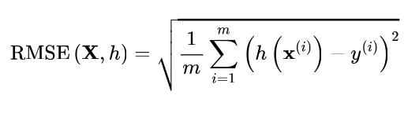
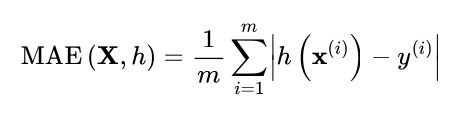
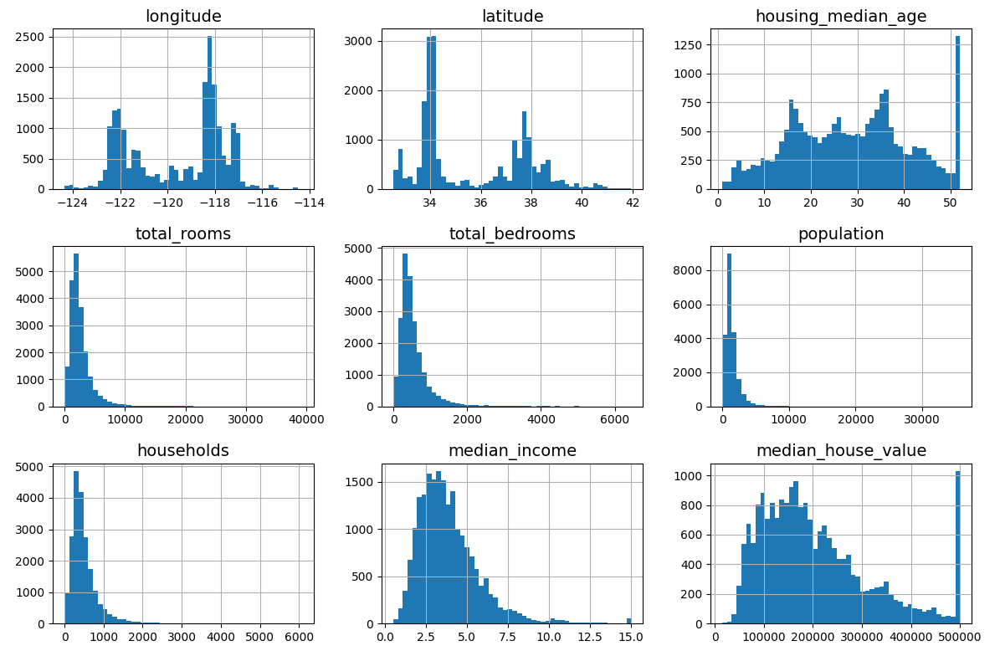
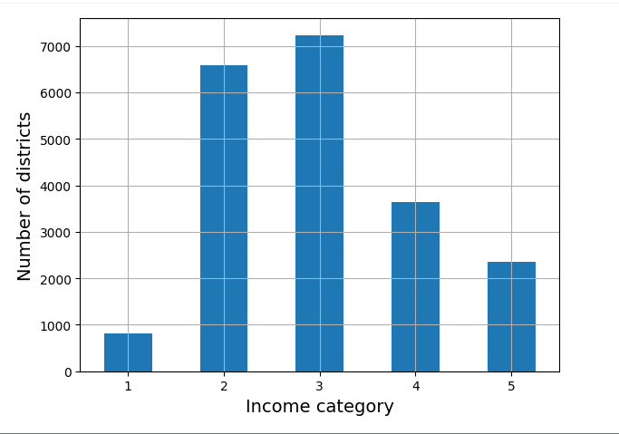
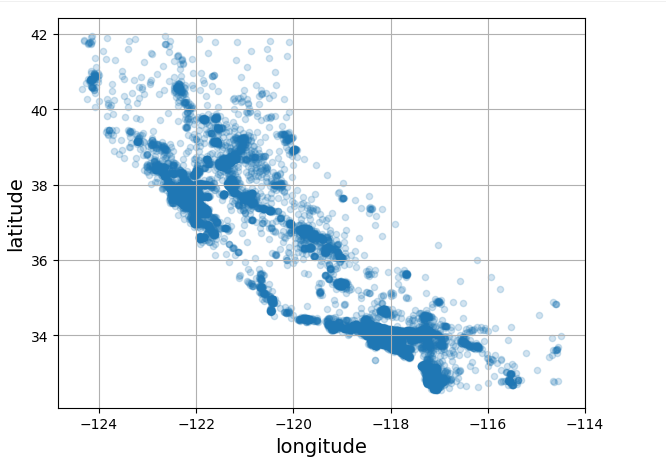

# AI

## Recursos genéricos
- [Learn Python](https://learnpython.org/)
- [Python]()https://docs.python.org/3/tutorial
- [NumPy](https://numpy.org/)
- [Pandas](https://pandas.pydata.org/)
- [Matplotlib](https://matplotlib.org/)
- [A Geron tutorial](https://homl.info/tutorials)
- [Tutorial algebra lineal](https://homl.info/tutorials)
- [Tutorial matemáticas](https://khanacademy.org/)

## Recursos AI
- Geron A. Hands-On (2023) Machine Learning with...3ed
- Ng A. Machine Learning. [Internet archive](https://archive.org/details/academictorrents_e8b1f9c5bf555fe58bc73addb83457dd6da69630/02_II._Linear_Regression_with_One_Variable_Week_1/07_Gradient_Descent_For_Linear_Regression_10_min.mp4)
- [Scikit-Learn user guide](https://scikit-learn.org/stable/user_guide.html)
- [Dataquest tutorial](https://dataquest.io/)
- [Quora ML blog](https://homl.info/1)

# Índice
- “The Fundamentals of Machine Learning”
  - The Machine Learning Landscape

# **The Fundamentals of Machine Learning**
# The Machine Learning Landscape
## Definición de machine learning 
<pre>
A computer program is said to learn from experience E with respect to some task T and some performance measure P, if its performance on T, as measured by P, improves with experience E.
—Tom Mitchell, 1997
</pre>

## Tipos de ML
### Training supervision
- supervised learning. El training set lleva incluida las soluciones.
- unsupervised learning. El training set no lleva incluida las soluciones.
  - Clasificación
  - detección de anomalías
  - simplificación de dimensiones
  - detección de asociaciones
- self-supervised learning. De un dataset sin soluciones, lo etiqueta.
- semi-supervised learning. Parte del training set lleva incluida las soluciones
- reinforcement learning. Aprender a hacer algo como Alpha0


### batch vs online learning
- batch learning: Primero aprende y luego aplica lo aprendido. Sihay que reaprender,hay que empezar de 0. Problema con datos que cambian mucho, etc
- online learning (incremental) lerning: Aprende poco a poco. Si el learning rate es muy alto, aprende rápido, pero olvida rápido

### instance-based vs model-based
- instance-based: Se aprende ejemplos de memoria y luego se generaliza.
- model-based: Se crea un modelo que se usa para luego hacer predicciones.

### Main Challenges of Machine Learning
- Ddatos: 
   - Es crucial tener un dataset representativo de los casos a estudiar.
   - Falta de datos
   - Datos irrelevantes (feature engineering, extraction)
- Mal algoritmo
  - Solo funciona para los datos del training set, pero no generaliza bien.
  - overfitting: el modelo es muy complejo
  - underfitting: el modeloes muy simple

### Testing and validation
Se suele tener los datos en training set 80% y test set 20%.
- buen % en training set y malo en test set -> overfitting

Selección de modelos.
1. Se divide el training data set en 2, uno grande llamado training y otro pequeño llamado dev o validation.
2. Se entrenan varios modelos con varios parámetros con el nuevo training
3. Se mira que modelo funciona mejor con el dev dataset
4. Se entrana el modelo elegido con el training set completo
5. Se valida con el test set

Un posible problema es que el validation set sea muy grande haciendo pequeño el training set, haciendo que el modelo se entrene con datos insuficientes.
Se devidiría en dev set en muchos mas pequeños y cada modelo se evaluaria varias veces para ver cual es el mas acertado

Data mismatch
El training data no es representativo de los datos de producción
1. Hacer el test set y el validation set con los datos mas representativos posibles
2. Crear desde el training set, datos no representativos, un set llamado train-dev
3. Entrenar el modelo con el trainig set
4. Evaluarlo con el train-dev. 
  - Si rinde mal entonces tiene overfitting, hay que simplificar el modelo
  - Si rinde bien, entonces evaluarlo en el dev set. Si rinde mal los datos de trainig no son representativos
5. una vez que evalue bien en train-dev y luego en dev set, se evalua en test

## End-to-End Machine Learning Project
1. Look at the big picture.
2. Get the data.
3. Explore and visualize the data to gain insights.
4. Prepare the data for machine learning algorithms.
5. Select a model and train it.
6. Fine-tune your model.
7. Present your solution.
8. Launch, monitor, and maintain your system.

### Working with Real Data
- Repositorios de datos
  - OpenML.org
  - Kaggle.com
  - KPapersWithCode.com
  - KUC Irvine Machine Learning Repository
  - KAmazon’s AWS datasets
  - KTensorFlow datasets
- Meta portals
  - DataPortals.org
  - OpenDataMonitor.eu
- otras páginas
  - Wikipedia’s list of machine learning datasets
  - Quora.com
  - The datasets subreddit

### Look at the big picture
Objetivo: calcular los precios de las casas

Design:
- supervised
- multiple regression
- batch

Performance measure:
Para regresiones lo típico es la media de los cuadrados de los errores, sobre todo si son de tipo campana de Gauss



Si en los datos hay alguno que sobresale mucho igual es mejor usar la media absoluta



### Get the data
Leo el csv
```
from pathlib import Path
import pandas as pd
import tarfile
import urllib.request

def load_housing_data():
    tarball_path = Path("datasets/housing.tgz")
    if not tarball_path.is_file():
        Path("datasets").mkdir(parents=True, exist_ok=True)
        url = "https://github.com/ageron/data/raw/main/housing.tgz"
        urllib.request.urlretrieve(url, tarball_path)
    with tarfile.open(tarball_path) as housing_tarball:
            housing_tarball.extractall(path="datasets")
    return pd.read_csv(Path("datasets/housing/housing.csv"))

housing = load_housing_data()
```

Miro los datos
```
housing.head()
 	  longitude 	latitude 	housing_median_age 	  total_rooms 	total_bedrooms 	population 	  households 	  median_income 	median_house_value 	ocean_proximity
0 	-122.23 	  37.88 	  41.0 	                880.0 	      129.0 	        322.0 	      126.0 	        8.3252      	452600.0 	          NEAR BAY
1 	-122.22 	  37.86 	  21.0 	                7099.0      	1106.0        	2401.0 	      1138.0        	8.3014      	358500.0          	NEAR BAY
2 	-122.24 	  37.85 	  52.0                	1467.0      	190.0 	        496.0       	177.0 	        7.2574      	352100.0 	          NEAR BAY
3 	-122.25 	  37.85 	  52.0                	1274.0      	235.0         	558.0        	219.0 	        5.6431      	341300.0          	NEAR BAY
4 	-122.25 	  37.85 	  52.0                	1627.0      	280.0         	565.0        	259.0 	        3.8462       	342200.0          	NEAR BAY

housing.info()
<class 'pandas.core.frame.DataFrame'>
RangeIndex: 20640 entries, 0 to 20639
Data columns (total 10 columns):
 #   Column              Non-Null Count  Dtype  
---  ------              --------------  -----  
 0   longitude           20640 non-null  float64
 1   latitude            20640 non-null  float64
 2   housing_median_age  20640 non-null  float64
 3   total_rooms         20640 non-null  float64
 4   total_bedrooms      20433 non-null  float64
 5   population          20640 non-null  float64
 6   households          20640 non-null  float64
 7   median_income       20640 non-null  float64
 8   median_house_value  20640 non-null  float64
 9   ocean_proximity     20640 non-null  object 
dtypes: float64(9), object(1)
memory usage: 1.6+ MB

# miro cuanto valores tiene ocean_proximity
housing["ocean_proximity"].value_counts()
                  count
ocean_proximity 	
<1H OCEAN 	      9136
INLAND          	6551
NEAR OCEAN        2658
NEAR BAY        	2290
ISLAND          	5
dtype: int64

housing.describe()
            longitude 	  latitude 	          housing_median_age 	total_rooms 	  total_bedrooms 	population  	households  	  median_income 	median_house_value
count 	    20640.000000 	20640.000000 	      20640.000000 	      20640.000000  	20433.000000 	  20640.000000 	20640.000000 	  20640.000000 	  20640.000000
mean      	-119.569704 	35.631861 	        28.639486 	        2635.763081   	537.870553 	    1425.476744 	499.539680 	    3.870671 	      206855.816909
std       	2.003532    	2.135952          	12.585558 	        2181.615252   	421.385070 	    1132.462122 	382.329753 	    1.899822 	      115395.615874
min       	-124.350000 	32.540000         	1.000000 	          2.000000      	1.000000 	      3.000000 	    1.000000 	      0.499900 	      14999.000000
25%       	-121.800000 	33.930000         	18.000000   	      1447.750000   	296.000000  	  787.000000  	280.000000 	    2.563400 	      119600.000000
50%       	-118.490000 	34.260000 	        29.000000   	      2127.000000   	435.000000 	    1166.000000 	409.000000 	    3.534800 	      179700.000000
75%       	-118.010000 	37.710000 	        37.000000   	      3148.000000   	647.000000  	  1725.000000 	605.000000 	    4.743250 	      264725.000000
max       	-114.310000 	41.950000         	52.000000   	      39320.000000  	6445.000000 	  35682.000000 	6082.000000 	  15.000100 	    500001.000000

```

Creo un directorio y una función para guardar imagenes
```
# extra code – code to save the figures as high-res PNGs for the book

IMAGES_PATH = Path() / "images" / "end_to_end_project"
IMAGES_PATH.mkdir(parents=True, exist_ok=True)

def save_fig(fig_id, tight_layout=True, fig_extension="png", resolution=300):
    path = IMAGES_PATH / f"{fig_id}.{fig_extension}"
    if tight_layout:
        plt.tight_layout()
    plt.savefig(path, format=fig_extension, dpi=resolution)
```

Dibujo histogramas de las columnas
```
import matplotlib.pyplot as plt

# extra code – the next 5 lines define the default font sizes
plt.rc('font', size=14)
plt.rc('axes', labelsize=14, titlesize=14)
plt.rc('legend', fontsize=14)
plt.rc('xtick', labelsize=10)
plt.rc('ytick', labelsize=10)

housing.hist(bins=50, figsize=(12, 8)) # todos los histogramas en un canvas de 12x8 pulgadas
save_fig("attribute_histogram_plots")  # extra code
plt.show()
```



En un análisis de los datos vemos que
- median_income: en realidad se ha normalizado y que una unidad son 10000
- housing_median_age: se ha puesto un valor límite
- median_house_value: se ha puesto un valor límite. Como esto es el valor a predecir puede ser un problema que puede tener varias soluciones
   - que no haya un problema
   - que haya que poner el valor correcto para los valores con ese límite
   - quitarlos del training y test set
- hay features con valores muchos mas altos/pequeños que otras features
- muchas features no siguen una gráfica de normal sino que están mas hacia la derecha

**Creo el test set**
- training set 80%
- test set 20% o menos si tenemos muchos datos

**A la hora de crear** el data set hay 2 posibilidades
- metodos aleatirios
- metodo de estratificación

POdemos saber el error de usar metodos aleatorios
<pre>
To find the probability that a random sample of 1,000 people contains less than 48.5% female or more than 53.5% female when the population's female ratio is 51.1%, we use the binomial distribution. The cdf() method of the binomial distribution gives us the probability that the number of females will be equal or less than the given value.

# extra code – shows how to compute the 10.7% proba of getting a bad sample

from scipy.stats import binom

sample_size = 1000
ratio_female = 0.511
proba_too_small = binom(sample_size, ratio_female).cdf(485 - 1)
proba_too_large = 1 - binom(sample_size, ratio_female).cdf(535)
print(proba_too_small + proba_too_large)

0.10736798530929942
</pre>

Esto significa que si en la población hay un 51.1% de chicas, tenmos un 10.7% de posibilidades que nuesto set tenta menos de 48,5% de chicas o mas de 53,5% de chicas y que los datos tengan bias.


**Si el dataset es grande** se pueden usar métodos aleatorios como los siguientes

```
import numpy as np

def shuffle_and_split_data(data, test_ratio):
    shuffled_indices = np.random.permutation(len(data))
    test_set_size = int(len(data) * test_ratio)
    test_indices = shuffled_indices[:test_set_size]
    train_indices = shuffled_indices[test_set_size:]
    return data.iloc[train_indices], data.iloc[test_indices]

train_set, test_set = shuffle_and_split_data(housing, 0.2)

len(train_set)
16512

len(test_set)
4128
```

Esto es solo para que cada vez que ejecute los comandos me den el mismo resultado
```
np.random.seed(42)
```

**importante** ahora tenemos que asegurarnos que el algoritno no va a ver nunca los datos del test set durante el entranmiento
Tanto si guardamos el test set aparte como si primero definimos el random seed np.random.seed(42) y luego hacemos lla permutación p.random.permutation(len(data) tiene el problema si se refresca el dataset.

La solución mas común es elegir el campo identificador y hacer un hash. El 20% de los registros con un hash menor al 20% del hash maximo va a test, el resto a training

```
from zlib import crc32

def is_id_in_test_set(identifier, test_ratio):
    return crc32(np.int64(identifier)) < test_ratio * 2**32

def split_data_with_id_hash(data, test_ratio, id_column):
    ids = data[id_column]
    in_test_set = ids.apply(lambda id_: is_id_in_test_set(id_, test_ratio))
    return data.loc[~in_test_set], data.loc[in_test_set]
```

Como no tengo un campo ID,  creo uno
Una forma: uso el número de fila. Tiene el problema que no se pueden borrar filas o se devalua el modelo
```
housing_with_id = housing.reset_index() # adds an `index` column
train_set, test_set = split_data_with_id_hash(housing_with_id, 0.2, "index")
```

Otra forma, hago una mezcla de longitude y latitude
```
housing_with_id["id"] = housing["longitude"] * 1000 + housing["latitude"]
train_set, test_set = split_data_with_id_hash(housing_with_id, 0.2, "id")
```


otra forma de separar los training y test es con la libreria de scikit-learn
```
from sklearn.model_selection import train_test_split
train_set, test_set = train_test_split(housing, test_size=0.2, random_state=42)
```


**Si el dataset no es muy grande** no valen los métodos aleatorios ya que por ejemplo en una empresa puede haber un 60% de mujeres y 40% de hombres.Si el estudio depende del género hay que asegurarse que este porcentaje es el mismo en los datasets

Si en nuestro ejemplo nos dicen que la media_income es un valor importante para hallar el precio de la casa tendré que asegurarme que el test set es representativo de las varias categorias de income de todo el dataset.

Como media_income es un valor númerico creo unos stratos/categorias, tienen que ser suficientes para ser representivas pero con suficientes datos cada una.

en este caso decido tener 5 categorias (1...5)
- categoría 1: 0 - 1,5  o lo que es lo mismo de 0 a 15000
- categoría 2: 1,5 - 3 
- categoría 3: 3 - 4,5
- categoría 4: 4,5 - 6
- categoría 5: 6 -

```
housing["income_cat"] = pd.cut(housing["median_income"],
                               bins=[0., 1.5, 3.0, 4.5, 6., np.inf],
                               labels=[1, 2, 3, 4, 5])
```

Estas son mis categorias
```
housing["income_cat"].value_counts().sort_index().plot.bar(rot=0, grid=True)
plt.xlabel("Income category")
plt.ylabel("Number of districts")
save_fig("housing_income_cat_bar_plot")  # extra code
plt.show()
```



Ahora divido los datos. Lo que hago es tener 10 divisiones aunque ahora trabaje con la primera 
```
from sklearn.model_selection import StratifiedShuffleSplit

splitter = StratifiedShuffleSplit(n_splits=10, test_size=0.2, random_state=42)
strat_splits = []
for train_index, test_index in splitter.split(housing, housing["income_cat"]):
    strat_train_set_n = housing.iloc[train_index]
    strat_test_set_n = housing.iloc[test_index]
    strat_splits.append([strat_train_set_n, strat_test_set_n])

strat_train_set, strat_test_set = strat_splits[0]
```

Si decidera crear solo con una division
```
strat_train_set, strat_test_set = train_test_split(
    housing, test_size=0.2, stratify=housing["income_cat"], random_state=42)
```

y compruebo. Veo que los número coinciden con la grafica de income. El strato 1 es el mas pequeño y el 3 el mas grande

```
strat_test_set["income_cat"].value_counts() / len(strat_test_set)
            count
income_cat 	
3 	        0.350533
2 	        0.318798
4 	        0.176357
5 	        0.114341
1 	        0.039971

dtype: float64
```

Puedo ver información de las categorias
```
# extra code – computes the data for Figure 2–10

def income_cat_proportions(data):
    return data["income_cat"].value_counts() / len(data)

train_set, test_set = train_test_split(housing, test_size=0.2, random_state=42)

compare_props = pd.DataFrame({
    "Overall %": income_cat_proportions(housing),
    "Stratified %": income_cat_proportions(strat_test_set),
    "Random %": income_cat_proportions(test_set),
}).sort_index()
compare_props.index.name = "Income Category"
compare_props["Strat. Error %"] = (compare_props["Stratified %"] /
                                   compare_props["Overall %"] - 1)
compare_props["Rand. Error %"] = (compare_props["Random %"] /
                                  compare_props["Overall %"] - 1)
(compare_props * 100).round(2)    compare_props["Overall %"] - 1)
(compare_props * 100).round(2)

 	                Overall % 	Stratified % 	Random % 	Strat. Error % 	Rand. Error %
Income Category 					
1 	              3.98 	      4.00 	        4.24 	    0.36 	          6.45
2 	              31.88 	    31.88 	      30.74 	  -0.02 	        -3.59
3 	              35.06 	    35.05 	      34.52 	  -0.01 	        -1.53
4 	              17.63 	    17.64 	      18.41 	  0.03 	          4.42
5 	              11.44 	    11.43 	      12.09 	  -0.08 	        5.63
```


como ya no voy a usar la categoria income_cat, la puedo borrar
```
for set_ in (strat_train_set, strat_test_set):
    set_.drop("income_cat", axis=1, inplace=True)
```

### Explore and visualize the data to gain insights.

hago una copia de seguridad
```
housing = strat_train_set.copy()
```

Como tengo datos de longitud y latitud los miro
```
housing.plot(kind="scatter", x="longitude", y="latitude", grid=True, alpha=0.2)
save_fig("better_visualization_plot")  # extra code
plt.show()
```



Hago un gráfico de los precios de las casas
- el tamaño de los puntos depende de el numero de habitantes s=housing["population"]
- el color de los puntos depende del precio de las casas c="median_house_value"
```
housing.plot(kind="scatter", x="longitude", y="latitude",
grid=True,
s=housing["population"] / 100, label="population",
c="median_house_value", cmap="jet", colorbar=True,
legend=True, sharex=False, figsize=(10, 7))
plt.show()
```

 entre todo par de atributos
```
corr_matrix = housing.corr(numeric_only=True)
 	                  median_house_value
median_house_value 	1.000000
median_income 	    0.688380
total_rooms 	      0.137455
housing_median_age 	0.102175
households 	        0.071426
total_bedrooms 	    0.054635
population 	        -0.020153
longitude 	        -0.050859
latitude 	          -0.139584
```

Otra forma de buscar atributos es la funcion de pandas scatter_matrix() pero como dibujaría 11 elevado a 11 graficos, vamos a limitarlo un poco
```
from pandas.plotting import scatter_matrix

attributes = ["median_house_value", "median_income", "total_rooms",
              "housing_median_age"]
scatter_matrix(housing[attributes], figsize=(12, 8))
save_fig("scatter_matrix_plot")  # extra code
plt.show()
```

save_fig("income_vs_house_value_scatterplot")  # extra code
plt.show()
```

corr_matrix["median_house_value"].sort_values(ascending=False)

                    median_house_value
median_house_value 	1.000000
median_income 	    0.688380
rooms_per_house 	  0.143663
total_rooms 	      0.137455
housing_median_age 	0.102175
households 	        0.071426
total_bedrooms 	    0.054635
population 	       -0.020153
people_per_house 	 -0.038224
longitude 	       -0.050859
latitude 	         -0.139584
bedrooms_ratio 	   -0.256397
```

### Prepare the data for machine learning algorithms.
Separa el valor a predecir, median_house_value, de los lables y creo una copia 
```
housing = strat_train_set.drop("median_house_value", axis=1)
housing_labels = strat_train_set["median_house_value"].copy()
```

**Clean the data**
Hemos visto que total_bedrooms no está siempre relleno y eso puede causar problemas. Hay varias opcines.
- No trabajo con los distritos en los que faltan los datos: dropna()
- No trabajo con ese atributo: drop()
- Pongo valores a ese atributo (imputation): fillna()

veo los campos vacíos
```
null_rows_idx = housing.isnull().any(axis=1)
housing.loc[null_rows_idx].head()
        longitude 	latitude 	housing_median_age 	total_rooms 	total_bedrooms 	population 	households 	median_income 	ocean_proximity
14452 	-120.67 	  40.50 	  15.0 	              5343.0 	      NaN 	          2503.0 	    902.0 	    3.5962 	        INLAND
18217 	-117.96 	  34.03 	  35.0 	              2093.0 	      NaN 	          1755.0 	    403.0 	    3.4115 	        <1H OCEAN
11889 	-118.05 	  34.04 	  33.0 	              1348.0 	      NaN 	          1098.0 	    257.0 	    4.2917 	        <1H OCEAN
20325 	-118.88 	  34.17 	  15.0 	              4260.0 	      NaN 	          1701.0 	    669.0 	    5.1033 	        <1H OCEAN
14360 	-117.87 	  33.62 	  8.0 	              1266.0 	      NaN 	          375.0 	    183.0 	    9.8020 	        <1H OCEAN

```

Opción 1: No trabajo con los distritos en los que faltan los datos: dropna()
```
housing_option1 = housing.copy()
housing_option1.dropna(subset=["total_bedrooms"], inplace=True)  # option 1
housing_option1.loc[null_rows_idx].head()

longitude 	latitude 	housing_median_age 	total_rooms 	total_bedrooms 	population 	households 	median_income 	ocean_proximity

```

Opción 2: No trabajo con ese atributo: drop()
```
housing_option2 = housing.copy()
housing_option2.drop("total_bedrooms", axis=1, inplace=True)  # option 2
housing_option2.loc[null_rows_idx].head()
        longitude 	latitude 	housing_median_age 	total_rooms 	population 	households 	median_income 	ocean_proximity
14452 	-120.67 	  40.50 	  15.0 	              5343.0 	      2503.0 	    902.0 	    3.5962 	        INLAND
18217 	-117.96 	  34.03 	  35.0 	              2093.0 	      1755.0 	    403.0 	    3.4115 	        <1H OCEAN
11889 	-118.05 	  34.04 	  33.0 	              1348.0 	      1098.0 	    257.0 	    4.2917 	        <1H OCEAN
20325 	-118.88 	  34.17 	  15.0 	              4260.0 	      1701.0 	    669.0 	    5.1033 	        <1H OCEAN
14360 	-117.87 	  33.62 	  8.0 	1             266.0 	      375.0 	    183.0 	    9.8020 	        <1H OCEAN
```

Opción 3a: Pongo valores a ese atributo (imputation): fillna()
```
housing_option3 = housing.copy()
median = housing["total_bedrooms"].median()
housing_option3["total_bedrooms"].fillna(median, inplace=True)  # option 3
housing_option3.loc[null_rows_idx].head()


        longitude 	latitude 	housing_median_age 	total_rooms 	total_bedrooms 	population 	households 	median_income 	ocean_proximity
14452 	-120.67 	  40.50 	  15.0 	              5343.0 	      434.0 	        2503.0 	    902.0 	    3.5962        	INLAND
18217 	-117.96 	  34.03 	  35.0 	              2093.0      	434.0 	        1755.0 	    403.0 	    3.4115 	        <1H OCEAN
11889 	-118.05 	  34.04 	  33.0 	              1348.0 	      434.0 	        1098.0    	257.0     	4.2917        	<1H OCEAN
20325 	-118.88 	  34.17 	  15.0 	              4260.0      	434.0 	        1701.0    	669.0     	5.1033        	<1H OCEAN
14360 	-117.87 	  33.62 	  8.0 	              1266.0      	434.0 	        375.0     	183.0     	9.8020        	<1H OCEAN
```

Opción 3b: Pongo valores a ese atributo (imputation): fillna()
La ventaja de este método es que rellenará los valores en registron que se vayan añadiendo
```
from sklearn.impute import SimpleImputer
imputer = SimpleImputer(strategy="median")
  # media: (strategy="mean")
  # most frequent value: (strategy="most_frequent")
  # constant value: (strategy="constant", fill_value=…). The last two strategies support non-numerical data.

# Como la media se toma sobre números creo una copia pero solo con atributos numéricos
housing_num = housing.select_dtypes(include=[np.number])

imputer.fit(housing_num)
  # hay otros imputers
  # KNNImputer replaces each missing value with the mean of the k-nearest neighbors’ values for that feature. The distance is based on all the available features.
  # IterativeImputer trains a regression model per feature to predict the missing values based on all the other available features. It then trains the model again on the updated data, and repeats the process several times, improving the models and the replacement values at each iteration.

imputer.statistics_
array([-118.51  ,   34.26  ,   29.    , 2125.    ,  434.    , 1167.    ,        408.    ,    3.5385])   # están la media de todos los atributos

housing_num.median().values
array([-118.51  ,   34.26  ,   29.    , 2125.    ,  434.    , 1167.    ,        408.    ,    3.5385])   # están la media de todos los atributos

# reemplazo los valores vacios con la media
X = imputer.transform(housing_num)

# el output es un NumPy array por lo que no tiene ni indices ni nombres de columnas. Se los vuelvo a añadir

# comprobación para ver las columnas
imputer.feature_names_in_
array(['longitude', 'latitude', 'housing_median_age', 'total_rooms',
       'total_bedrooms', 'population', 'households', 'median_income'],
      dtype=object)

housing_tr = pd.DataFrame(X, columns=housing_num.columns, index=housing_num.index)
housing_tr.loc[null_rows_idx].head()
        longitude 	latitude 	housing_median_age 	total_rooms 	total_bedrooms 	population 	households 	median_income
14452 	-120.67   	40.50   	15.0              	5343.0 	      434.0         	2503.0 	    902.0     	3.5962
18217 	-117.96 	  34.03   	35.0              	2093.0 	      434.0         	1755.0    	403.0     	3.4115
11889 	-118.05 	  34.04   	33.0              	1348.0      	434.0 	        1098.0    	257.0 	    4.2917
20325 	-118.88 	  34.17 	  15.0 	              4260.0      	434.0 	        1701.0    	669.0     	5.1033
14360 	-117.87   	33.62   	8.0 	              1266.0 	      434.0 	        375.0 	    183.0 	    9.8020
```